# SkyFlow: AI-Powered Flight Delay Prediction for Optimized Airline Operations

Dipti Aswath | [LinkedIn](https://www.linkedin.com/in/dipti-aswath-60b9131) | [Email](mailto:dipti.aswath@gmail.com)

## Executive Summary

### Problem Statement:

Airlines and airports face significant operational challenges due to flight delays, which can be caused by a variety of factors including flight status, weather conditions, air traffic congestion, aircraft specifics, and inefficiencies in ground and passenger handling. The objective is to predict flight delays by developing a multi-class classification model that considers both departure and arrival delays, helping improve operational planning and customer satisfaction.

### Rationale:

Flight delays can have widespread consequences for airlines, from passenger dissatisfaction to operational disruptions. Developing a predictive model for flight delays not only addresses the core issue of minimizing delays but also enhances decision-making processes across various facets of airline operations.

#### Business Case 1: Enhancing Operational Efficiency

Predicting flight delays enables airlines to optimize their operations, routing, and resource management.

-   **Route Optimization and Scheduling Adjustments**: Airlines can reroute flights to avoid congested airspace or adverse weather, minimizing delays. Predictions also allow real-time adjustments to schedules, gates, and crew to manage disruptions efficiently.

-   **Resource Allocation**: By anticipating delays, airlines can proactively allocate ground crew, gates, and equipment, reducing the cascading effects on other flights.

-   **Operational Resilience**: Dynamic rerouting and resource realignment minimize the operational impacts of weather or high-traffic delays, enhancing resilience in crisis situations.

-   **Cost Management**: Avoiding delays lowers costs linked to operational disruptions, improving resource utilization and overall profitability.

#### Business Case 2: Improving Customer Experience

Accurate delay predictions lead to better customer service and proactive communication, enhancing the passenger experience.

-   **Proactive Passenger Communication**: Accurate predictions allow airlines to update passengers promptly, manage expectations, and offer rebooking or compensation options.

-   **Improved Customer Service**: Delay forecasts support better service recovery, leading to a smoother passenger experience and increased loyalty.

-   **Competitive Advantage**: Effective rerouting and communication give airlines an edge in maintaining on-time performance and customer satisfaction.

By addressing these areas, airlines can significantly improve operational efficiency, enhance passenger experience with better customer satisfaction scores, and better manage resources and disruptions. Predictive modeling for flight delays is not just about minimizing delays but also about fostering a more responsive and resilient airline operation.

#### Example Usage: An AI system that predicts flight delays could:

1.  Suggest alternate flight paths that are less likely to experience delays.

2.  Provide passengers with timely updates and rebooking options.

3.  Dynamically adjust flight schedules to manage disruptions effectively.

4.  Allocate resources efficiently to minimize the impact on subsequent flights.

### Research Question:

How can a multi-class classification model be developed to accurately predict flight delays by assessing multiple factors, including departure and arrival delays, using data related to flight status, weather conditions, air traffic, aircraft specifics, and ground operations?

### Key Findings from Exploratory Data Analysis

**Highest Departure and Arrival delays by Carriers (2019):** Identifying the carriers with the highest delays directly relates to **improved customer experience and financial impact**. By pinpointing these carriers, airlines can better manage customer expectations, offer targeted support, and address issues that could lead to costly disruptions and compensation claims.

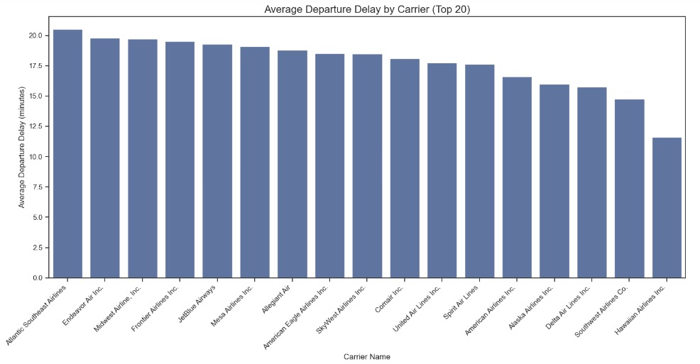

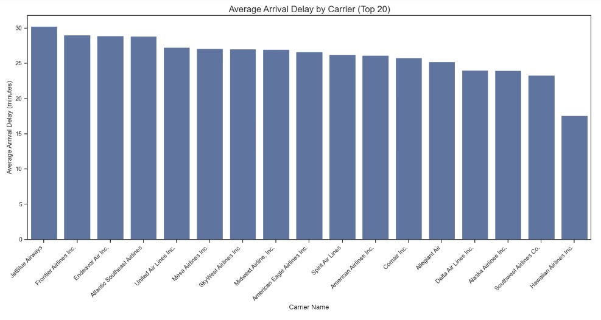

**Top 30 Congested Airports with Flight Delays (2019):** This finding supports **enhanced operational efficiency and operational resilience**. By focusing on the most congested airports, airlines can optimize resource allocation and improve scheduling to alleviate delays at these critical points, leading to smoother operations and better crisis management.


**SMOTE Resampling on Training Data:** Demonstrates the importance of **data-driven decision making**. By improving model performance through resampling, airlines can make more accurate predictions about delays, leading to better strategic planning and performance monitoring.

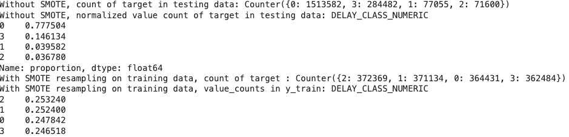

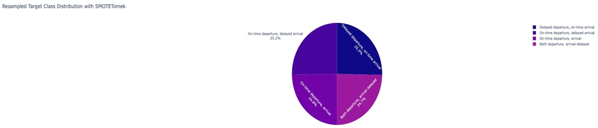

**Delay Trends Across Distance Groups and Flight Segments (2019):** This finding helps provide valuable insights into how aircraft operational schedules and the number of daily flights contributed to 2019 delays, effectively addressing **operational efficiency and contingency planning**. Understanding how delay patterns vary with flight distance and segment numbers helps airlines plan better turnaround times and manage operational schedules more effectively to prevent delays.

-   **Segment Number Decreases with Distance**: As flight distance increases, the number of segments (flights) decreases. Aircraft flying longer routes complete fewer flights in a day due to time constraints.

-   **Delays Correlate with Higher Segment Numbers**: Flights scheduled for more segments in a day are more prone to delays, regardless of distance. These delays are likely due to operational factors, such as shorter turnaround times, leading to delayed departures and arrivals.

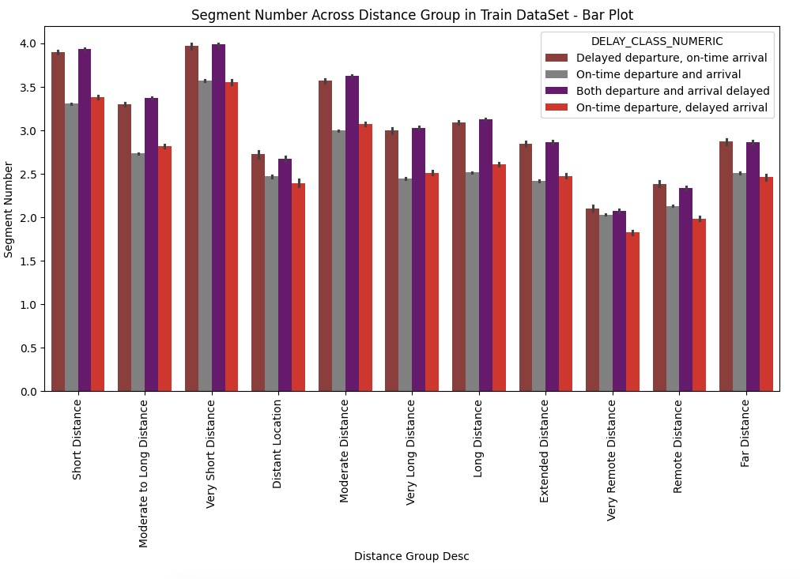

**Median Departure and Arrival Delays per Carrier (2019):** Identified the top 20 carriers with the highest median delays. For each carrier, the top 20 airports with the most significant contribution to delays were also identified. By examining median delays, airlines can gain insights into typical delay experiences and ensure compliance with regulations. Focusing on specific carriers and airports with high delays can enhance **overall safety and customer satisfaction**.

-   **Comprehensive Delay Analysis:** By considering both departure and arrival delays, we provide a more holistic view of 2019 airline performance and airport efficiency. Endeavor Air Inc shows a highest delay at Miami International Airport. Comair Inc follows with the next highest delay at Portland International Airport.

-   **Focus on median delays**: The use of median delays helped identify typical delay experiences, filtering out the effect of extreme delays that skewed averages.

-   **Unique Operational Factors:** The variation in delay trends suggests that delays may be influenced by distinct factors specific to each carrier and airport, rather than being caused by common issues across multiple locations. For instance, both Endeavor Air Inc and Comair Inc experienced higher-than-usual precipitation at the airports on their flight day, which could have contributed to their delays.


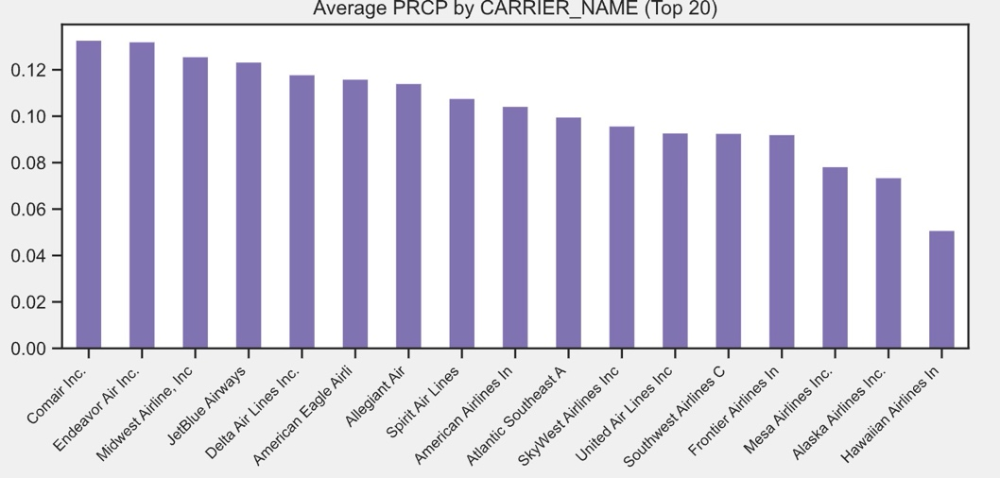

[TODO - Add more key findings]

### Actionable Insights: Recommendations from Exploratory Data Analysis 

[TODO]


### Model Evaluation Summary and Performance Metrics

The following classification models were evaluated for predicting flight delays, listed in order:

-   Dummy Classifier (baseline)

-   Multinomial Logistic Regression

-   Decision Trees with hyperparameter tuning

-   Random Forest

-   XGBoost

-   CatBoost

-   Voting Classifier (ensemble of XGBoost and Random Forest)

-   Bagging Classifier (with XGBoost as the base estimator)

#### Model Evaluation Metrics

The bagging, boosting, and ensemble models outperformed the baseline, Logistic Regression, and Decision Tree models. Below is a comparison table highlighting their key metrics.

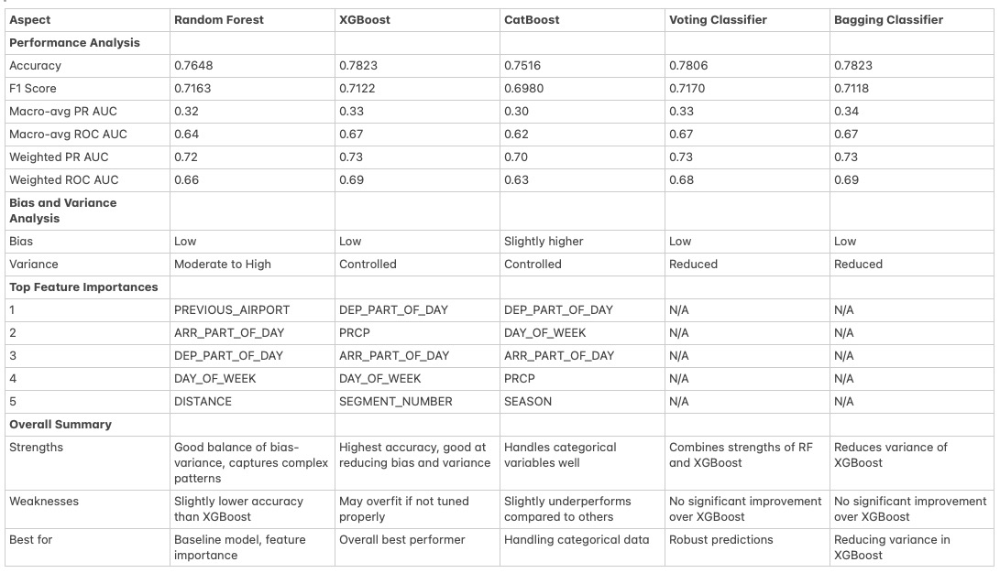

##### Key Observations with Model Evaluations:

-   High Accuracy: All models achieve accuracy above 75%, with XGBoost and Bagging Classifier reaching 78.23%.

-   Good F1 Scores: F1 scores are consistently above 0.70.

-   Ensemble Methods: Voting Classifier and Bagging Classifier show improvements over individual models, demonstrating effective use of ensemble techniques.

-   Consistent Feature Importance: There's consistency in important features across models.

-   Weather Integration: The importance of PRCP (precipitation) shows successful integration of weather data into the models.

-   Temporal Features: The models effectively utilize time-based features (DEP_PART_OF_DAY, ARR_PART_OF_DAY, DAY_OF_WEEK), which are crucial for flight delay prediction.

-   Class Imbalance: All models struggle with classes 1 and 2 (delayed departure or delayed arrivals) because of the class imbalance.

##### Model Deployment Recommendations:

Primary Model: XGBoost is recommended as the primary choice for deployment due to its overall superior performance:

1.  Highest accuracy (0.7823)

2.  Best weighted ROC AUC (0.69)

3.  Strong performance in weighted PR AUC (0.73)

4.  Good balance between bias and variance

Backup/Ensemble Model: Voting Classifier (XGBoost + Random Forest) – This model should be considered as a backup or complementary model:

1.  Nearly matches XGBoost's performance (accuracy: 0.7806)

2.  Provides robustness through ensemble learning

#### Feature Importances across Models

Below is a comparison of the feature importances of the top 5 features across the three models (Random Forest, XGBoost, and CatBoost) using both permutation importance and built-in feature importance methods. Note, that the Voting Classifier and Bagging Classifier did not have separate feature importances as they are ensemble methods.

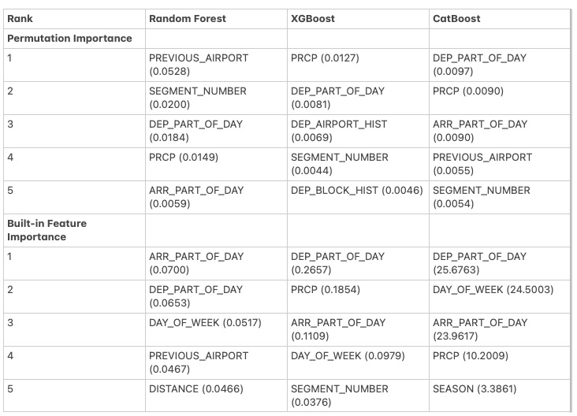

##### Key Observations with Features used by models:

-   DEP_PART_OF_DAY and PRCP are consistently important across all models and methods.

-   Temporal features (DEP_PART_OF_DAY, ARR_PART_OF_DAY, DAY_OF_WEEK) are crucial for all models.

-   Built-in importances tend to favor categorical features more than permutation importances.

-   CatBoost's built-in importances show much larger values compared to other models.

##### Feature Selection Recommendations:

-   Prioritize temporal features (DEP_PART_OF_DAY, ARR_PART_OF_DAY, DAY_OF_WEEK) and weather data (PRCP).

-   Consider SEGMENT_NUMBER and PREVIOUS_AIRPORT as potentially important features.

-   Interactions between high-importance features, especially temporal and weather features play a key role.

#### Detailed evaluation metrics for each model can be found in the Appendix.

## Data Sources

Kaggle Dataset from [here](https://www.kaggle.com/datasets/threnjen/2019-airline-delays-and-cancellations/data), that is comprised of multiple csv's listed below.

-   Air Carrier Summary

-   Aircraft Inventory

-   Air Carrier employee support (Ground Crew, Flight Attendants)

-   Flight On Time Reporting Status with Air Carrier info for 2019-2020

-   Airport Weather

-   Airport and Carrier look-up codes

## Methodology Used

**CRISP-DM Framework:** 
TODO

**Data Preparation:** Involved cleaning and merging multiple raw CSV files to create a unified data-set with \~4M entries (for training) and \~2M entries (for testing) with 34 predictor variables and 1 target variable. Raw data-set description is [here](https://github.com/diptiaswath/airlineFlightDelayPrediction/blob/main/raw_data/raw_data_documentation.txt).

**Feature Engineering:**

-   Delay Categories: Classified delays into four distinct categories for more granular analysis of flight performance:

    Class0: On-time Departure and Arrival - Flights that depart and arrive within their scheduled times.

    Class1: On-time Departure, Delayed Arrival - Flights that experience delays during arrival, but depart on time.

    Class2: Delayed Departure, On-time Arrival - Flights that experience delays during departure but still arrive on time.

    Class3: Delayed Departure and Arrival - Flights that experience delays both in departure and arrival times.

    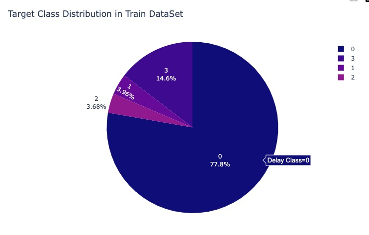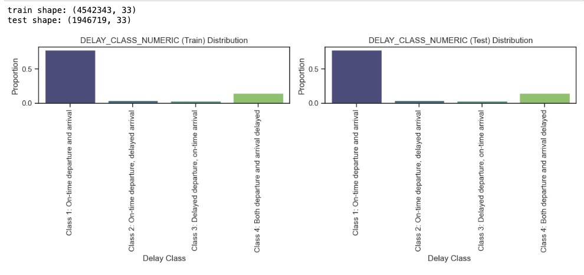

-   Aggregation Features: Developed historical delay averages, to identify patterns and trends in airline operations.

    ```
        CARRIER_HISTORICAL = captures the historical average delay rate of each carrier per month

        DEP_AIRPORT_HIST = captures historical average delay rates for flights departing from specific airports per month

        PREV_AIRPORT_HIST = captures historical average delay rate for the airport from which the aircraft arrived before the current departure

        DAY_HISTORICAL = captures historical average delays associated with each day of the week, adjusted monthly

        DEP_BLOCK_HIST = captures historical average delay rate for different departure time blocks, aggregated by month
    ```

-   Time-Based Features: Extracted seasonal information from the month and categorized parts of the day using departure and arrival time blocks to enhance temporal analysis of flight data.

    

    

-   Distance-Based Features: Mapped distance groups to descriptive labels, providing clearer insights into flight range categories for more intuitive analysis.

    

-   Delay-Based Features: Created new features by combining actual departure and arrival times with scheduled times, generating detailed delay metrics to enhance analysis of flight performance and punctuality.

    ```
        ELAPSED_TIME_DIFF, DEP_DELAY, ARR_DELAY
    ```
-   Employee Statistics Features: Developed features to analyze staffing and resourcing in airline and carrier operations, providing insights into workforce allocation, scheduling efficiency, and resource optimization.

    ```
        FLT_ATTENDANTS_PER_PASS, PASSENGER_HANDLING
    ```

-   Removed highly correlated features with VIF

    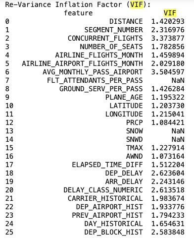

**Data Pre-Processing:** Missing values and outliers detected were removed. SMOTETomek was applied to just the training data-set. This combined SMOTE's oversampling of the minority classes (classes 1,2 and 3) and Tomek links' under-sampling. Categorical features were also target encoded and Numerical features were scaled.

**Train, Validation and Test Split:** TODO

**Modeling and Evaluation:** Classification algorithms used were Decision Trees, Random Forest, and multi-nomial Logistic Regression, with evaluation metrics: F1 Score, PR AUC, ROC AUC and Accuracy scores. Feature Selection, specifically Recursive Feature Elimination (RFE) was used to select features from among the 34 predictor variables for Decision Treee and Logistic Regression Classifier.

## Project Structure

**Data:**

-   [Engineered Features Documentation](https://github.com/diptiaswath/airlineFlightDelayPrediction/blob/main/combined_data/dataset_documentation.txt)

-   Merged Datasets: [Train](https://github.com/diptiaswath/airlineFlightDelayPrediction/blob/main/combined_data/train.pkl) \| [Test](https://github.com/diptiaswath/airlineFlightDelayPrediction/blob/main/combined_data/test.pkl)

-   [Raw Data](https://github.com/diptiaswath/airlineFlightDelayPrediction/tree/main/raw_data)

-   [Raw Data Documentation](https://github.com/diptiaswath/airlineFlightDelayPrediction/blob/main/raw_data/raw_data_documentation.txt)

**Analysis and Visualization:**

-   [AutoViz Plots](https://github.com/diptiaswath/airlineFlightDelayPrediction/tree/main/plots) (Credit: [AutoViML/AutoViz](https://github.com/AutoViML/AutoViz))

-   [README Images](https://github.com/diptiaswath/airlineFlightDelayPrediction/tree/main/images)

**Notebooks:**

-   [Data Preparation and Feature Engineering](https://github.com/diptiaswath/airlineFlightDelayPrediction/blob/main/notebooks/flight-delays-data-prep-and-eda_v1.ipynb)

-   [Additional Data Exploration](https://github.com/diptiaswath/airlineFlightDelayPrediction/blob/main/notebooks/flight-delays-data-exploration_v1.ipynb)

-   [Data Pre-processing, Modeling, and Evaluation](https://github.com/diptiaswath/airlineFlightDelayPrediction/blob/main/notebooks/flight-delays-data-preproc-and-modeling_v1.ipynb)

-   [Utility Functions](https://github.com/diptiaswath/airlineFlightDelayPrediction/blob/main/notebooks/utils/common_functions.ipynb)

**Git Large File Storage (LFS):**

This project uses Git Large File Storage (LFS) to handle large files efficiently. Git LFS replaces large files with text pointers inside Git, while storing the file contents on a remote server.

#### To work with this repository:

-   Ensure you have Git LFS installed. If not, install it from [git-lfs.com](https://git-lfs.com).

-   After cloning the repository, run: 

     ```
        git lfs install 
        git lfs pull 
     ```       

-   When adding new large files, track them with: 

    ``` 
        git lfs track "path/to/large/file" 
    ```     

-   Commit and push as usual. Git LFS will handle the large files automatically. For more information on Git LFS, refer to the [official documentation](https://git-lfs.com/).

## Project Infrastructure

This project utilized Google Colab Pro to handle computationally intensive notebook operations for data exploration and modeling. Key components include:

**Notebooks:**

-   Data exploration and modeling results from Colab Pro are captured in notebooks available in this GitHub repository.

-   Direct links to key external notebooks for results: [Exploration Notebook](https://drive.google.com/file/d/136lYzQDpJ9rODL6nGHwUe3S37fY8L1c_/view?usp=drive_link), [Modeling Notebook](https://drive.google.com/file/d/1wR0uXhx9T_DXFRhNy-dKAz7XZkCIQQdy/view?usp=drive_link)

**AutoViz Visualizations:**

-   Comprehensive AutoViz plots generated during data exploration are externally stored [here](https://drive.google.com/drive/folders/1N_Drv8Gvx0ANEk3fiaMAguF1JY8ptAd3?usp=drive_link) due to size constraints on GitHub.

**Decision Tree and Random Forest Artifacts**

-   Decision tree structures and rule sets are available in two locations:

    -   Externally: View [here](https://drive.google.com/drive/folders/1qXDYyuo2lqJBwFTBoI7KCV45SZC-w163?usp=drive_link)

    -   Locally: In the [images](https://github.com/diptiaswath/airlineFlightDelayPrediction/tree/main/images) folder of this repository

-   [TODO for Random Forest Artifacts]

## Key Insights from Phase 1 to Phase 2 of Project

[TODO]

## Next Steps

-   Feature Engineering: Use Dimensionality Reduction and Clustering to reduce dimensions, and cluster features together to reduce the count of 34 predictors. Relying on Feature Selection techniques alone, takes a while to train any of the classification models.

-   Explore Neural Network models to see if performance can be improved further.

-   Use StreamLit and Fast API to serve flight prediction delays via an application interface

## 

## Appendix

### Baseline Dummy Classifier

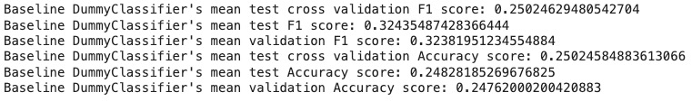

### Multinomial Logistic Regression Classifier

[TODO]

### Decision Tree – Original vs. Hyper-Parameter tuned Decision Tree

#### Original Decision Tree

[Plot Tree](https://drive.google.com/file/d/1AvAqaliIrgzmXr1LmOCu2uv6v6OrsQI2/view?usp=sharing)

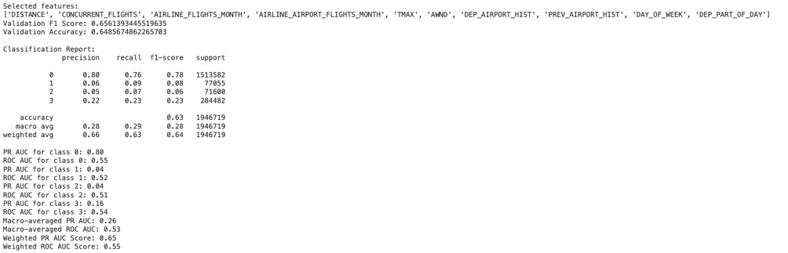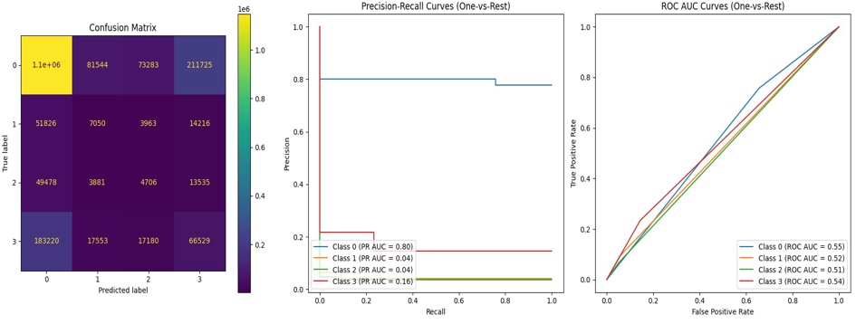

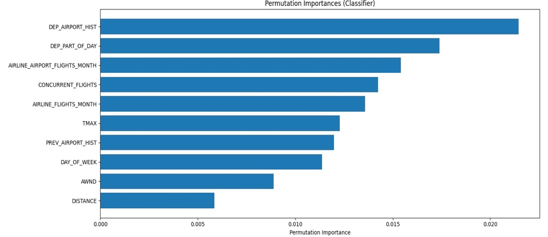

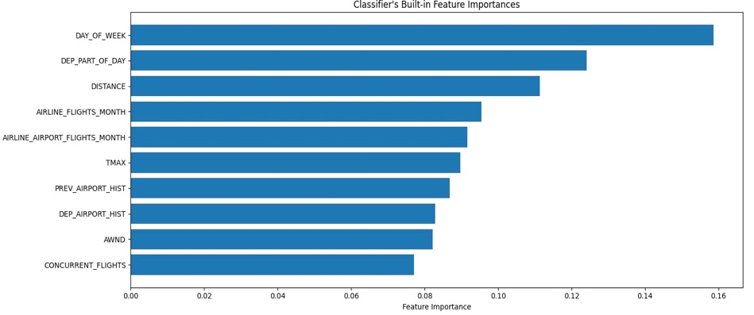

#### Hyper-Parameter tuned Decision Tree

[Decision Tree Rules](https://drive.google.com/file/d/1-6eoRoPugySwIHnwEcrTfpa8EjB3Xszw/view?usp=sharing) and [Plot Tree](https://drive.google.com/file/d/1mqMruSxPR5IsCufHfEU3r7Ub3R5cfNXJ/view?usp=sharing)

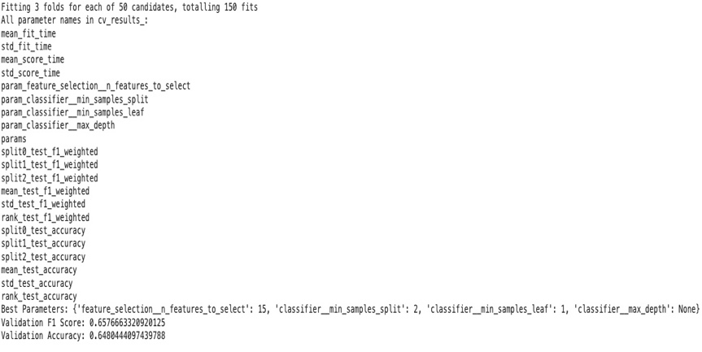

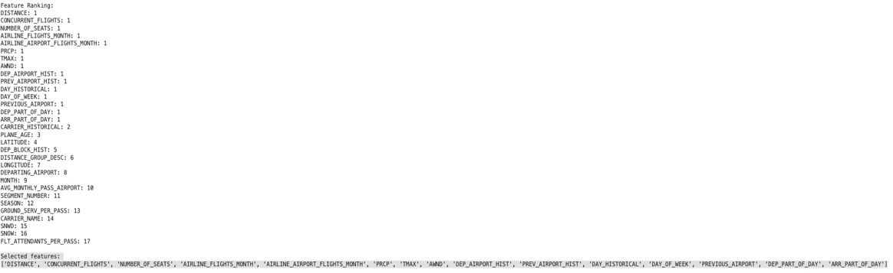

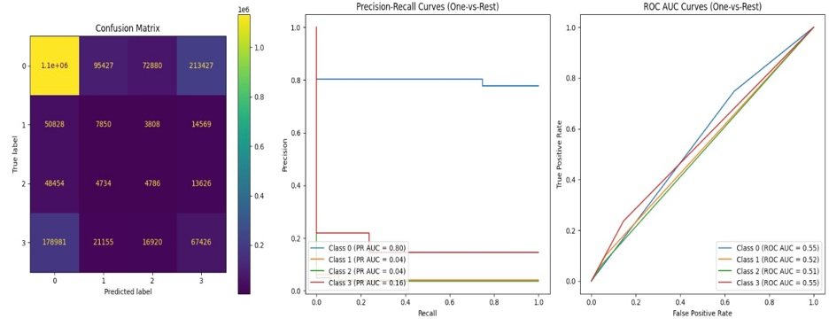

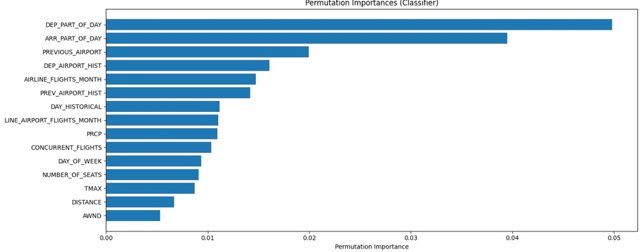

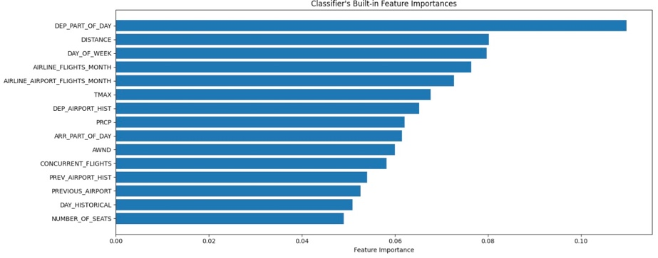

### Comparison of Logistic Regression and Decision Tree Models

| Aspect | Decision Tree | Hyper-Parameter Tuned Decision Tree | Logistic Regression |
|--------|---------------|-------------------------------------|---------------------|
| **Performance Analysis** |
| F1 Score | 0.6561 | 0.6577 | 0.5637 |
| Accuracy | 0.6486 | 0.6480 | 0.4922 |
| Macro Avg F1 | 0.28 | 0.28 | 0.28 |
| Weighted Avg F1 | 0.64 | 0.64 | 0.59 |
| Macro-averaged ROC AUC | 0.53 | 0.53 | 0.60 |
| Weighted ROC AUC | 0.55 | 0.55 | 0.62 |
| **Bias vs. Variance** |
| Bias | Moderate | Moderate | High |
| Variance | High | High | Low |
| **Selected Features** | Top 5 by permutation importance:<br>1. DEP_AIRPORT_HIST<br>2. DEP_PART_OF_DAY<br>3. AIRLINE_AIRPORT_FLIGHTS_MONTH<br>4. AIRLINE_FLIGHTS_MONTH<br>5. CONCURRENT_FLIGHTS<br><br>Top 5 by built-in importance:<br>1. DAY_OF_WEEK<br>2. DEP_PART_OF_DAY<br>3. DISTANCE<br>4. AIRLINE_FLIGHTS_MONTH<br>5. AIRLINE_AIRPORT_FLIGHTS_MONTH | Top 5 by permutation importance:<br>1. DEP_PART_OF_DAY<br>2. ARR_PART_OF_DAY<br>3. PREVIOUS_AIRPORT<br>4. DEP_AIRPORT_HIST<br>5. AIRLINE_FLIGHTS_MONTH<br><br>Top 5 by built-in importance:<br>1. DEP_PART_OF_DAY<br>2. DISTANCE<br>3. DAY_OF_WEEK<br>4. AIRLINE_FLIGHTS_MONTH<br>5. AIRLINE_AIRPORT_FLIGHTS_MONTH | Selected features:<br>1. SEGMENT_NUMBER<br>2. PREV_AIRPORT_HIST<br>3. DEP_BLOCK_HIST<br>4. MONTH<br>5. DAY_OF_WEEK<br>6. CARRIER_NAME<br>7. PREVIOUS_AIRPORT<br>8. DEP_PART_OF_DAY<br>9. ARR_PART_OF_DAY<br>10. DISTANCE_GROUP_DESC |
| **Feature Importance Analysis** | - DEP_AIRPORT_HIST and DEP_PART_OF_DAY are consistently important<br>- AIRLINE_FLIGHTS_MONTH and AIRLINE_AIRPORT_FLIGHTS_MONTH show high importance<br>- DAY_OF_WEEK has high built-in importance but lower permutation importance | - DEP_PART_OF_DAY and ARR_PART_OF_DAY are highly important<br>- PREVIOUS_AIRPORT and DEP_AIRPORT_HIST are significant<br>- DISTANCE is important in built-in metrics but less so in permutation importance | - Includes unique features like SEGMENT_NUMBER and DEP_BLOCK_HIST<br>- Emphasizes categorical features (CARRIER_NAME, DISTANCE_GROUP_DESC)<br>- Includes both departure and arrival related features |
| **Overall Summary** |
| Strengths | - Good overall accuracy<br>- Balanced performance across classes<br>- Interpretable<br>- Relies heavily on historical and time-based features<br>- Considers airline and airport-specific metrics | - Slightly improved F1 score<br>- Similar performance to base DT<br>- Potential for better generalization<br>- Emphasizes time of day features<br>- Balances historical, geographical, and time-based features<br>- Includes weather features | - Better at identifying minority classes<br>- Lower variance<br>- Good ROC AUC scores<br>- Uses a mix of flight-specific and general features<br>- Includes categorical features not present in tree models<br>- Focuses on historical patterns and time-based features |
| Weaknesses | - Poor performance on minority classes<br>- Potential overfitting<br>- DAY_OF_WEEK importance varies between methods | - Still struggles with minority classes<br>- Complex model | - Lower overall accuracy<br>- Struggles with imbalanced data |
| Best suited for | - When interpretability is important<br>- When historical and time-based features are crucial | - When slightly better performance is needed<br>- When some overfitting is acceptable<br>- When a balance of various feature types is desired | - When probabilistic outputs are needed<br>- When a simpler model is preferred<br>- When categorical features are important |

### Random Forest Classifier

[TODO – PDP plots]

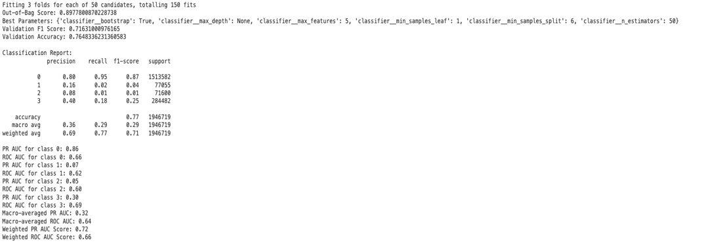

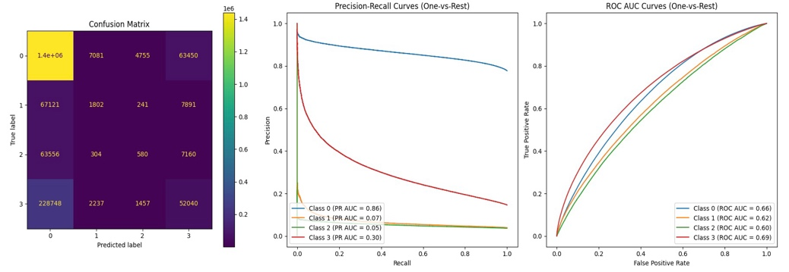

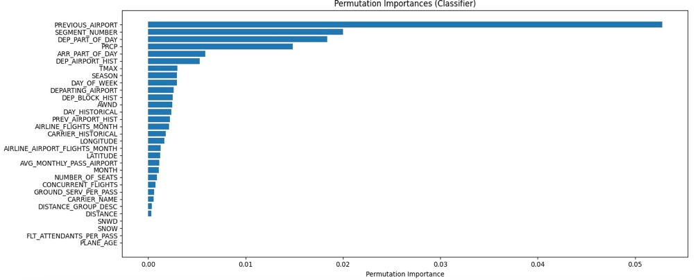

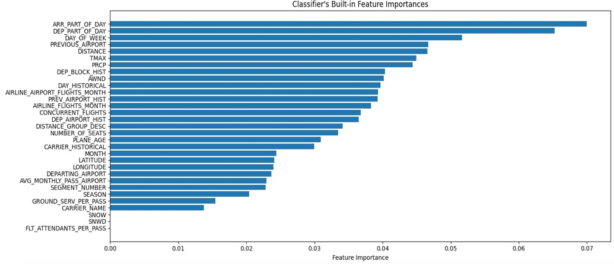

### XGBoost Classifier

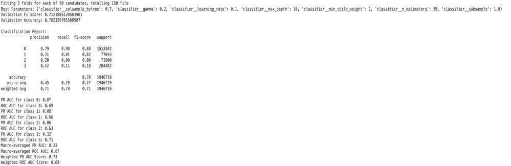

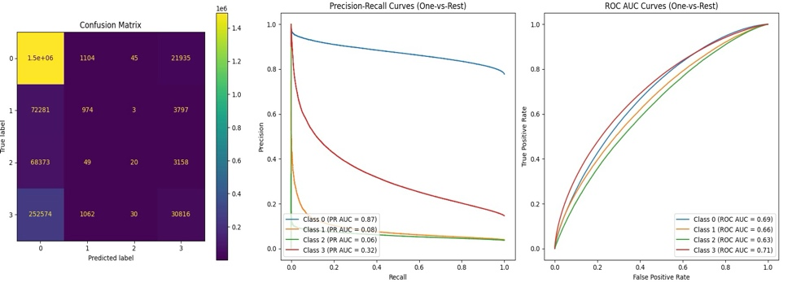

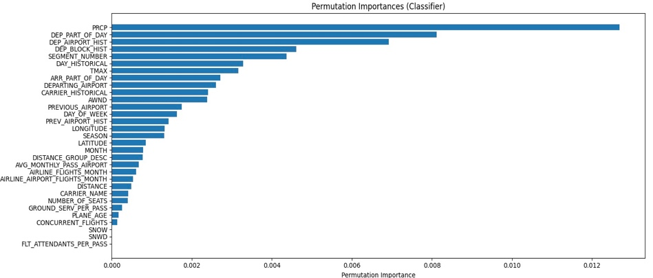

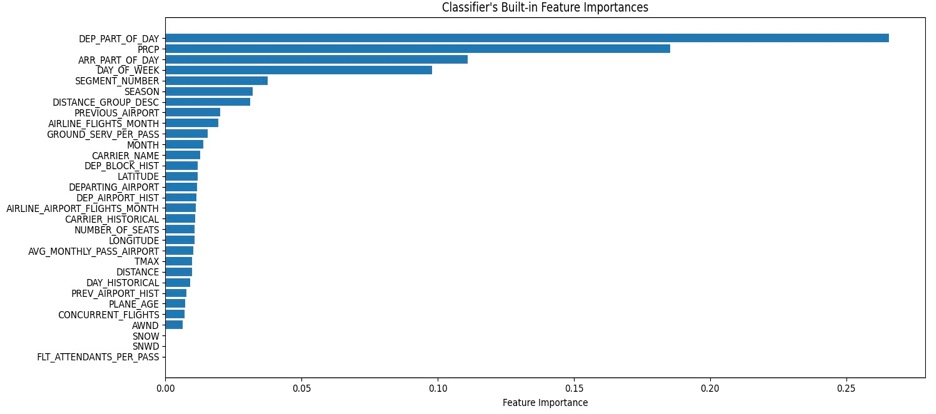

### CatBoost Classifier


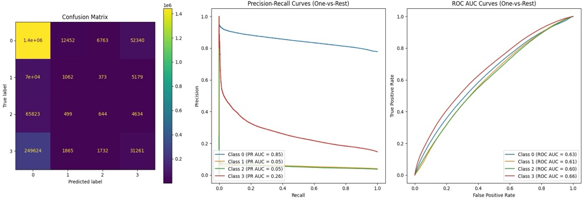

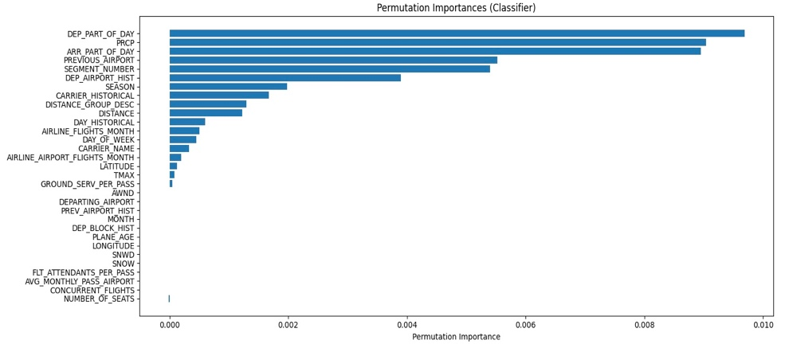

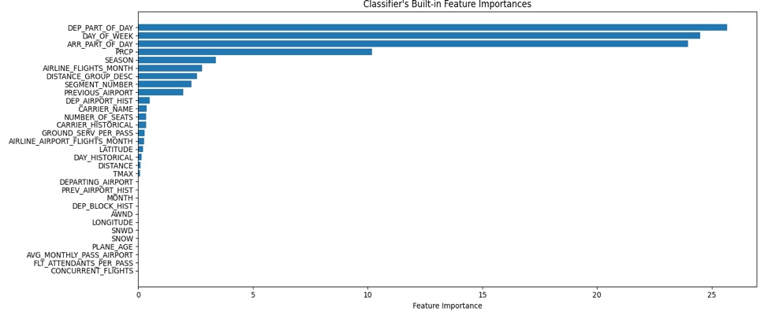

### Voting Classifier (ensemble of XGBoost and Random Forest)

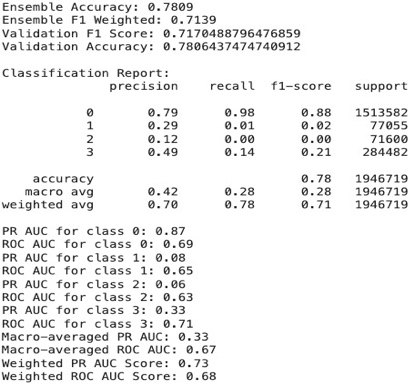

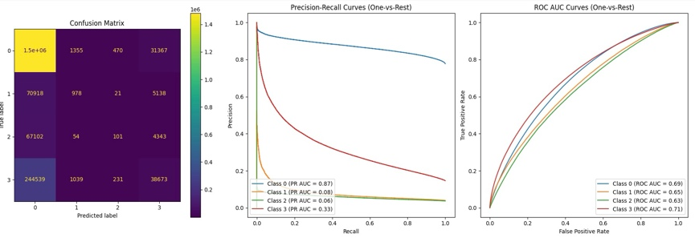

### Bagging Classifier (with XGBoost as the base estimator)


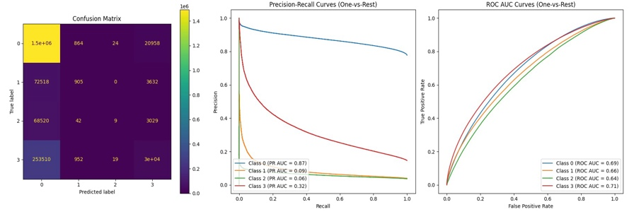

## References

TODO
