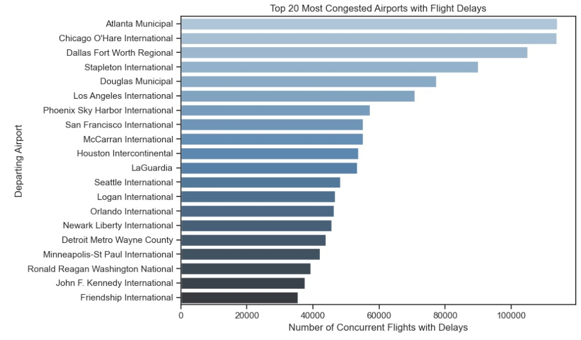
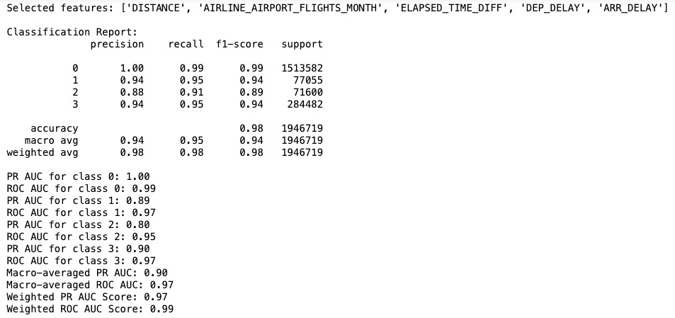
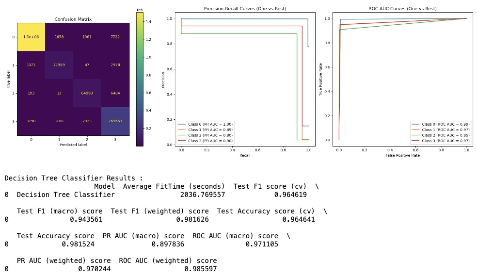

# Optimizing Airline Operations: Predicting Delays for Smarter Routes and Efficient Resource Management

Dipti Aswath

## Executive Summary

### Problem Statement:

Airlines and airports face significant operational challenges due to flight delays, which can be caused by a variety of factors including flight status, weather conditions, air traffic congestion, aircraft specifics, and inefficiencies in ground and passenger handling. The objective is to predict flight delays by developing a multi-class classification model that considers both departure and arrival delays, helping improve operational planning and customer satisfaction.

### Rationale:

Flight delays can have widespread consequences for airlines, from passenger dissatisfaction to operational disruptions. Developing a predictive model for flight delays not only addresses the core issue of minimizing delays but also enhances decision-making processes across various facets of airline operations.

#### Business Use Case: Airline Route Optimization:

-   **Proactive Rerouting**: Predicting delays enables airlines to reroute flights, helping avoid congested airspace or airports experiencing delays, thereby reducing the overall impact on flight schedules and minimizing delay time.

-   **Weather Avoidance**: Forecasting weather-related delays allows for dynamic adjustments to flight routes, ensuring safer and more efficient travel by avoiding adverse weather conditions.

#### Business Use Case: Airline Operations Management:

-   **Scheduling Adjustments**: Delay predictions empower airlines to adjust schedules in real time, reallocating resources like gates, ground crew, and equipment to manage disruptions effectively.

-   **Resource Allocation**: Advanced knowledge of delays facilitates more efficient allocation of resources, such as repositioning aircraft and crew, reducing the cascading impact of delays on subsequent flights.

-   **Passenger Communication**: With accurate delay predictions, airlines can inform passengers in advance, manage expectations, and provide better customer service, such as offering rebooking options or compensation for delays.

#### Example Usage: An AI system that predicts flight delays could:

1.  Suggest alternate flight paths that are less likely to experience delays.

2.  Provide passengers with timely updates and rebooking options.

3.  Dynamically adjust flight schedules to manage disruptions effectively.

4.  Allocate resources efficiently to minimize the impact on subsequent flights.

### Research Question:

How can a multi-class classification model be developed to accurately predict flight delays by assessing multiple factors, including departure and arrival delays, using data related to flight status, weather conditions, air traffic, aircraft specifics, and ground operations?

### Key Findings from Exploratory Data Analysis:

1.  Highest 2019 departure and arrival delays by Carriers

1.  Top 30 congested airports in 2019 with flight delays

1.  SMOTE Resampling on Training Data

1.  **By examining segment number trends across Distance Group descriptors**, we gain valuable insights into how aircraft operational schedules and the number of daily flights contributed to 2019 delays.

**Segment Number Decreases with Distance**: As flight distance increases, the number of segments (flights) decreases. Aircraft flying longer routes complete fewer flights in a day due to time constraints.

**Delays Correlate with Higher Segment Numbers**: Flights scheduled for more segments in a day are more prone to delays, regardless of distance. These delays are likely due to operational factors, such as shorter turnaround times, leading to delayed departures and arrivals.

1.  **Median Departure and Arrival Delays per Carrier:** Identified the top 20 carriers with the highest median delays, considering both departure and arrival delays. For each carrier, the top 20 airports with the most significant contribution to delays were identified.

**Comprehensive Delay Analysis:** By considering both departure and arrival delays, this analysis provides a more holistic view of 2019 airline performance and airport efficiency. Endeavor Air Inc shows a highest delay at Miami International. Comair Inc follows with the next highest delay at Portland International Airport.

**Focus on median delays**: The use of median delays here helped identify typical delay experiences, filtering out the effect of extreme delays that skewed averages.

**Unique Operational Factors**: The variation in delay trends suggests that delays may be influenced by unique factors for each carrier and airport rather than common issues across multiple locations.

### Model Evaluation Summary and Performance Metrics:

**Baseline Model with Dummy Classifier:**

**Multinomial Logistic Regression Classifier:**

**Decision Tree Classifier:**

**Random Forest Classifier:**

## Data Sources:

Kaggle Dataset from [here](https://www.kaggle.com/datasets/threnjen/2019-airline-delays-and-cancellations/data), that is comprised of multiple csv's listed below.

1.  Air Carrier Summary

2.  Aircraft Inventory

3.  Air Carrier employee support (Ground Crew, Flight Attendants)

4.  Flight On Time Reporting Status with Air Carrier info for 2019-2020

5.  Airport Weather

6.  Airport and Carrier look-up codes

## Methodology Used:

1.  Data Preparation

    Involved cleaning and merging multiple raw CSV files to create a unified data-set with \~4M entries (for training) and \~2M entries (for testing) with 34 predictor variables and 1 target variable. Raw data-set description is [here](https://github.com/diptiaswath/airlineFlightDelayPrediction/blob/main/raw_data/raw_data_documentation.txt).

2.  Feature Engineering

    1.  Delay Categories: Classified delays into four classes/categories. a) **On-time Departure and Arrival:** Flights that depart and arrive within their scheduled times. b) **Delayed Departure, On-time Arrival:** Flights that experience delays during departure but still arrive on time or within a minimal delay window. c) **On-time Departure, Delayed Arrival**. d) **Delayed Departure and Arrival:** Flights that experience delays both in departure and arrival times.

        

    2.  Aggregation Features: Created historical delay averages such as,

        CARRIER_HISTORICAL = captures the historical average delay rate of each carrier per month

        DEP_AIRPORT_HIST = captures historical average delay rates for flights departing from specific airports per month

        PREV_AIRPORT_HIST = captures historical average delay rate for the airport from which the aircraft arrived before the current departure

        DAY_HISTORICAL = captures historical average delays associated with each day of the week, adjusted monthly

        DEP_BLOCK_HIST = captures historical average delay rate for different departure time blocks, aggregated by month

    3.  Time Based Features: Extracted season from month and part of the day from departure and arrival time blocks

        

        

    4.  Distance Based Features: Mapped distance groups to descriptive text

    

    5.  Delay Based Features: Created new features by combining actual departure and arrival times with planned times to create new delay features, ELAPSED_TIME_DIFF, DEP_DELAY, ARR_DELAY

    6.  Employee Features: Created employee statistics features FLT_ATTENDANTS_PER_PASS and PASSENGER_HANDLING for analyzing airline and carrier operations

    7.  Removed highly correlated features with VIF

    

    8.   Engineered features with their descriptions can be found [here](https://github.com/diptiaswath/airlineFlightDelayPrediction/blob/main/combined_data/dataset_documentation.txt)

3.  Data Pre-Processing: Missing values and outliers detected were removed. SMOTETomek was applied to just the training data-set. This combined SMOTE's oversampling of the minority classes (classes 1,2 and 3) and Tomek links' under-sampling. Categorical features were also target encoded and Numerical features were scaled.

4.  Modeling and Evaluation: Classification algorithms used were Decision Trees, Random Forest, and multi-nomial Logistic Regression, with evaluation metrics: F1 Score, PR AUC, ROC AUC and Accuracy scores. Sequential Feature Selection was used to select 5 features from among the 34 predictor variables.

## Outline of Project:

1.  Engineered Features and description [here](https://github.com/diptiaswath/airlineFlightDelayPrediction/blob/main/combined_data/dataset_documentation.txt)

2.  Merged Data for [train](https://github.com/diptiaswath/airlineFlightDelayPrediction/blob/main/combined_data/train.csv) and [test](https://github.com/diptiaswath/airlineFlightDelayPrediction/blob/main/combined_data/test.csv) is [here](https://github.com/diptiaswath/airlineFlightDelayPrediction/tree/main/combined_data)

3.  Raw Data used for creating merged data is [here](https://github.com/diptiaswath/airlineFlightDelayPrediction/tree/main/raw_data)

4.  Exploratory Data Analysis plots from Auto Viz Visualization Library is [here](https://github.com/diptiaswath/airlineFlightDelayPrediction/tree/main/plots). Credits: Seshadri, Ram (2020). GitHub - AutoViML/AutoViz: Automatically Visualize any dataset, any size with a single line of code. source code: https://github.com/AutoViML/AutoViz)

5.  Images captured in this README are located [here](https://github.com/diptiaswath/airlineFlightDelayPrediction/tree/main/images)

6.  Jupyter notebooks, a) Notebook for data preparation, merges and initial exploratory analysis is [here](https://github.com/diptiaswath/airlineFlightDelayPrediction/blob/main/notebooks/flight-delays-data-prep-and-eda_v1.ipynb), b) Notebook for data pre-processing, additional exploratory analysis, modeling and evaluation is [here](https://github.com/diptiaswath/airlineFlightDelayPrediction/blob/main/notebooks/flight-delays-data-preproc-and-modeling_v1.ipynb)

## Next Steps:

1.  Use Dimensionality Reduction and Clustering to reduce dimensions, and cluster features together to reduce the count of 34 predictors. Relying on Sequential Feature Selection alone, takes a while to train any of the classification models.

2.  Use SVC classifier to compare its performance with others

3.  Use StreamLit and Fast API to serve flight prediction delays via an application interface
