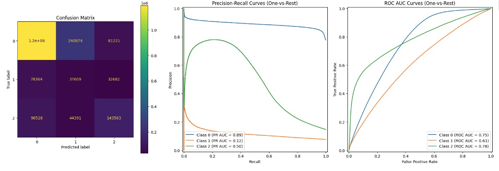
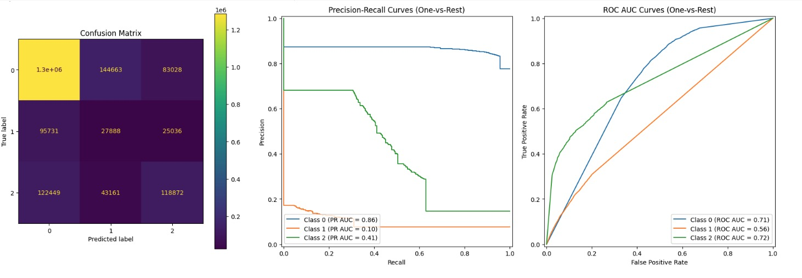

# SkyFlow: AI-Powered Flight Delay Prediction for Optimized Airline Operations

Dipti Aswath \| [LinkedIn](https://www.linkedin.com/in/dipti-aswath-60b9131) \| [Email](mailto:dipti.aswath@gmail.com) \| Early [SkyFlow](http://18.219.112.73:8501/) Prototype

## Table of Contents

1. [Executive Summary](#executive-summary)

    - [Problem Statement](#problem-statement)

    - [Rationale](#rationale)

        - [Business Case 1: Enhancing Operational Efficiency](#business-case-1-enhancing-operational-efficiency)

        - [Business Case 2: Improving Customer Experience](#business-case-2-improving-customer-experience)

    - [Research Question](#research-question)

    - [Evaluation Criteria](#evaluation-criteria)

    - [Approach](#approach)

        - [CRISP-DM Framework](#crisp-dm-framework)
     
        - [Feature Engineering Approach](#feature-engineering-approach)

    - [Key Findings from Exploratory Data Analysis](#key-findings-from-exploratory-data-analysis)

    - [Actionable Insights - Recommendations from Exploratory Data Analysis](#actionable-insights---recommendations-from-exploratory-data-analysis)

    - [Model Evaluation Summary and Performance Metrics](#model-evaluation-summary-and-performance-metrics)

        - [Performance Comparison Across Baseline, Logistic Regression and Decision Tree Classifiers](#performance-comparison-across-baseline-logistic-regression-and-decision-tree)

        - [Performance Comparison Across Ensemble Bagging and Boosting Classifiers](#performance-comparison-across-ensemble-bagging-and-boosting-classifiers)

        - [Performance Comparison Across Hybrid Ensemble Classifiers](#performance-comparison-across-hybrid-ensemble-classifiers)

    - [Recommendations for Model Selection and Deployment for Flight Delay Predictions](#recommendations-for-model-selection-and-deployment-for-flight-delay-predictions)

    - [Features influencing model recommendation](#features-influencing-model-recommendation)

    - [Recommendations based on influential features in Flight Delay Predictions](#recommendations-based-on-influential-features-in-flight-delay-predictions)

    - [Partial Dependence Plots: Analyzing Feature Impact on Flight Delay Predictions for each Delay Class](#partial-dependence-plots-analyzing-feature-impact-on-flight-delay-predictions-for-each-delay-class)

2. [Data Sources](#data-sources)

3. [Methodology Used for Data Preparation and Modeling](#methodolody-used-for-data-preparation-and-modeling)

4. [Project Structure](#project-structure)

    - [Data](#data)

    - [Analysis and Visualization](#analysis-and-visualization)

    - [Notebooks](#notebooks)

    - [Model Artifacts](#model-artifacts)

    - [StreamLit and FastAPI interface](#streamlit-and-fastapi-interface)

    - [Repository with GitLFS](#repository-with-gitlfs)

5. [Project Infrastructure](#project-infrastructre)

6. [Key Insights from Phase1 to Phase2 of Project](#key-insights-from-phase1-to-phase2-of-project)

7. [Future Work](#future-work)

8. [Appendix](#appendix)

9. [References](#references)

## Executive Summary

### Problem Statement:

Airlines and airports face significant operational challenges due to flight delays, which can be caused by a variety of factors including flight status, weather conditions, air traffic congestion, aircraft specifics, and inefficiencies in ground and passenger handling. The objective is to predict flight delays by developing a multi-class classification model that considers both departure and arrival delays, helping improve operational planning and customer satisfaction.

### Rationale:

Flight delays can have widespread consequences for airlines, from passenger dissatisfaction to operational disruptions. Developing a predictive model for flight delays not only addresses the core issue of minimizing delays but also enhances decision-making processes across various facets of airline operations.

#### Business Case 1: Enhancing Operational Efficiency

Predicting flight delays enables airlines to optimize their operations, routing, and resource management.

-   **Route Optimization and Scheduling Adjustments**: Airlines can reroute flights to avoid congested airspace or adverse weather, minimizing delays. Predictions also allow real-time adjustments to schedules, gates, and crew to manage disruptions efficiently.

-   **Resource Allocation**: By anticipating delays, airlines can proactively allocate ground crew, gates, and equipment, reducing the cascading effects on other flights.

-   **Operational Resilience**: Dynamic rerouting and resource realignment minimize the operational impacts of weather or high-traffic delays, enhancing resilience in crisis situations.

-   **Cost Management**: Avoiding delays lowers costs linked to operational disruptions, improving resource utilization and overall profitability.

#### Business Case 2: Improving Customer Experience

Accurate delay predictions lead to better customer service and proactive communication, enhancing the passenger experience.

-   **Proactive Passenger Communication**: Accurate predictions allow airlines to update passengers promptly, manage expectations, and offer rebooking or compensation options.

-   **Improved Customer Service**: Delay forecasts support better service recovery, leading to a smoother passenger experience and increased loyalty.

-   **Competitive Advantage**: Effective rerouting and communication give airlines an edge in maintaining on-time performance and customer satisfaction.

By addressing these areas, airlines can significantly improve operational efficiency, enhance passenger experience with better customer satisfaction scores, and better manage resources and disruptions. Predictive modeling for flight delays is not just about minimizing delays but also about fostering a more responsive and resilient airline operation.

#### Example Usage: An AI system that predicts flight delays could also:

1.  Suggest alternate flight paths that are less likely to experience delays.

2.  Provide passengers with timely updates and rebooking options.

3.  Dynamically adjust flight schedules to manage disruptions effectively.

4.  Allocate resources efficiently to minimize the impact on subsequent flights.

### Research Question:

How can a multi-class classification model be developed to accurately predict flight delays by assessing multiple factors, including departure and arrival delays, using data related to flight status, weather conditions, air traffic, aircraft specifics, and ground operations?

### Evaluation Criteria:

For predicting flight delays as a multi-class classification problem with:

-   **Class 0**: On-time flights

-   **Class 1**: Either the departure or arrival of the current flight is delayed

-   **Class 2**: Both departure and arrival of the current flight are delayed

The key criteria and metrics considered are:

1.  **Accurately predict delays while maintaining the accuracy of on-time flight predictions.**

2.  **Strike a balance between:**

    -   **High recall for delays**: Ensuring delayed flights are correctly identified.

    -   **High precision for delays**: Avoiding misclassification of on-time flights as delayed.

To monitor **overall model performance**, we use **Precision-Recall Area Under the Curve (PR AUC)** and **Receiver Operating Characteristic Area Under the Curve (ROC AUC)**. For evaluating the balance between recall and precision, we rely on the **F1 Score** as the primary metric.

### Approach:

#### CRISP-DM Framework:

For the Flight Delay Prediction problem, the CRISP-DM (Cross Industry Standard Process for Data Mining) framework was applied to provide a structured solution. The process was as follows:

1.  **Business Understanding:** The goal was to predict flight delays to improve airline operational efficiency and enhance customer satisfaction by reducing unexpected delays.

2.  **Data Understanding:** A detailed analysis of the dataset was performed, identifying key patterns and relationships, such as flight times, delays, and distances, that could significantly influence prediction outcomes.

3.  **Data Preparation:** The raw data was preprocessed, and relevant features were engineered. This included detailed delay metrics such as departure and arrival times, distances, and other flight-specific attributes to ensure high-quality inputs for model training.

4.  **Modeling:** Various machine learning models were trained and evaluated, focusing on performance metrics like Precision-Recall AUC, ROC AUC, and F1 score. These models were iteratively tuned to optimize predictive performance.

5.  **Deployment:** The best-performing model was integrated into **SkyFlow’s** prototype application, enabling real-time flight delay predictions. Future iterations aim to further enhance operational decision-making.

#### Feature Engineering Approach: 

During the data preparation phase, significant feature engineering was conducted as outlined in a later Methodology section. Initially, features that captured the relationship between departure and arrival delays were found to introduce data leakage, leading to overly optimistic predictions. As a result, these features were excluded in Phase 2.

To improve model performance in Phase2, new features were engineered by tracking flight segment sequences for each tail number on a given day (e.g., SEGMENT_NUMBER). **Historical flight information**, such as previous airports (PREVIOUS_AIRPORT), prior delays (PREVIOUS_ARR_DELAY), and flight durations (PREVIOUS_DURATION), was incorporated. This was done by merging **current flight records** with its own FLIGHT_DURATION with the corresponding previous segment data, providing a richer and more comprehensive dataset for predicting delays.

##### Enhanced Feature Engineering Algorithm

```
    ###### Input:
    - Raw flight data
    - Aircraft data
    - Weather data
    - Airport data
    - Airline data

    ###### Output:
    - Enriched dataset with engineered features for flight delay prediction

    ###### Algorithm:

    1. Initialize empty dataset D for engineered features

    2. For each flight record F in raw flight data:

        2.1. Extract basic flight information (date, origin, destination, etc.)

        2.2. Compute SEGMENT_NUMBER:

            a. Group flights by TAIL_NUM and DAY_OF_MONTH

            b. Sort by DEP_TIME within each group

            c. Assign sequential numbers starting from 1

        2.3. Add SEGMENT_NUMBER to D

    3. For each flight record F in D:

        3.1. Identify previous flight P with same TAIL_NUM

        3.2. If P exists:

            a. Set PREVIOUS_AIRPORT = P.DESTINATION

            b. Set PREVIOUS_ARR_DELAY = P.ARR_DELAY

            c. Set PREVIOUS_DEP_DELAY = P.DEP_DELAY

            d. Set PREVIOUS_DURATION = P.ACTUAL_ELAPSED_TIME

        3.3. Else:

            Set all PREVIOUS_* features to null or appropriate default values

        3.4. Add PREVIOUS_* features to D

    4. Compute FLIGHT_DURATION:

        4.1. FLIGHT_DURATION = CRS_ARR_TIME - CRS_DEP_TIME

        4.2. Add FLIGHT_DURATION to D

    5. Merge weather data with D based on date and airport

    6. Compute temporal features:

        6.1. Extract MONTH, DAY_OF_WEEK from date

        6.2. Compute SEASON based on MONTH

        6.3. Compute DEP_PART_OF_DAY based on CRS_DEP_TIME

        6.4. Add temporal features to D

    7. Merge airport and airline data with D

    8. Compute historical performance metrics:

        8.1. Calculate CARRIER_HISTORICAL (average delay by carrier and month)

        8.2. Calculate DEP_AIRPORT_HIST (average delay by departure airport and month)

        8.3. Calculate DEP_BLOCK_HIST (average delay by departure time block and month)

        8.4. Add historical metrics to D

    9. Handle missing values and perform necessary data type conversions

    10. Return enriched dataset D
```

### Key Findings from Exploratory Data Analysis:

**Highest Departure and Arrival delays by Carriers (2019):** Identifying the carriers with the highest delays directly relates to **improved customer experience and financial impact**. By pinpointing these carriers, airlines can better manage customer expectations, offer targeted support, and address issues that could lead to costly disruptions and compensation claims.


**Top 30 Congested Airports with Flight Delays (2019):** This finding supports **enhanced operational efficiency and operational resilience**. By focusing on the most congested airports, airlines can optimize resource allocation and improve scheduling to alleviate delays at these critical points, leading to smoother operations and better crisis management.


**SMOTE Resampling on Training Data:** Demonstrates the importance of **data-driven decision making**. By improving model performance through resampling, airlines can make more accurate predictions about delays, leading to better strategic planning and performance monitoring.


**Delay Trends Across Distance Groups and Flight Segments (2019):** This finding helps provide valuable insights into how aircraft operational schedules and the number of daily flights contributed to 2019 delays, effectively addressing **operational efficiency and contingency planning**. Understanding how delay patterns vary with flight distance and segment numbers helps airlines plan better turnaround times and manage operational schedules more effectively to prevent delays.

-   **Segment Number Decreases with Distance**: As flight distance increases, the number of segments (flights) decreases. Aircraft flying longer routes complete fewer flights in a day due to time constraints.

-   **Delays Correlate with Higher Segment Numbers**: Flights scheduled for more segments in a day are more prone to delays, regardless of distance. These delays are likely due to operational factors, such as shorter turnaround times, leading to delayed departures and arrivals.


**Median Departure and Arrival Delays per Carrier (2019):** Identified the top 20 carriers with the highest median delays. For each carrier, the top 20 airports with the most significant contribution to delays were also identified. By examining median delays, airlines can gain insights into typical delay experiences and ensure compliance with regulations. Focusing on specific carriers and airports with high delays can enhance **overall safety and customer satisfaction**.

-   **Comprehensive Delay Analysis:** By considering both departure and arrival delays, we provide a more holistic view of 2019 airline performance and airport efficiency. Endeavor Air Inc shows a highest delay at Miami International Airport. Comair Inc follows with the next highest delay at Portland International Airport.

-   **Focus on median delays**: The use of median delays helped identify typical delay experiences, filtering out the effect of extreme delays that skewed averages.

-   **Unique Operational Factors:** The variation in delay trends suggests that delays may be influenced by distinct factors specific to each carrier and airport, rather than being caused by common issues across multiple locations. For instance, both Endeavor Air Inc and Comair Inc experienced higher-than-usual precipitation at the airports on their flight day, which could have contributed to their delays.


**Analyzing Trends in Flight Delays by Distance Groups (2019):** This focuses on understanding how flight delays vary across different distance categories, which helps airlines optimize their operations to inform strategies to mitigate delays.

It can be observed that flights traveling short and moderate distances tend to have higher delays compared to the remainder of the distance categories.


**Analyzing Trends in Flight Delays by Season, Time of Day and Day of Week (2019):** This trend analysis aims to assist airlines in optimizing their operations by informing strategies to mitigate delays.

-   **Seasonal Trends:** Summer months generally experience the highest rates of both arrival and departure delays, while winter months also show significant arrival delays.

-   **Time of Day:** Early morning and late-night flights are associated with the highest arrival delays, whereas afternoon and evening flights tend to experience more departure delays.

-   **Weekly Patterns:** There is a noticeable dip in arrival delays on Saturdays, while other days of the week exhibit a relatively even distribution of both arrival and departure delays.


**Analyzing Historical Average Delays (2019):** Visualize the average historical delays of DEP_BLOCK_HIST, which represents the historical average delay for different departure time blocks aggregated by month, and DEP_AIRPORT_HIST, indicating the historical average delay rates for flights departing from specific airports per month. This analysis examines how these metrics fluctuate due to various time-related and seasonal factors, aiming to provide insights into delay patterns across different times of day, days of the week, and seasons.Bottom of Form

-   **Seasonal Trends:** Historical average delays are generally higher during the summer months, followed by winter and spring.

-   **Weekly Trends:** Historical delays are evenly distributed throughout the week.

-   **Time of Day:** Average delays for different departure time blocks are notably higher in the afternoons and evenings.


**Analyzing Average Weather features by Airlines and Airports (2019):** This analysis was done to understand how selected weather features (PRCP, TMAX, AWND, SNOW, SNWD) vary across different carriers, departing airports, and previous airports, to observe any patterns with how weather conditions impact flight operations.

There was no significant trend observed in the average values of the selected weather features, when grouped by the specified columns (CARRIER_NAME, DEPARTING_AIRPORT, PREVIOUS_AIRPORT).


### Actionable Insights - Recommendations from Exploratory Data Analysis:

| **Finding** | **Recommendation** |
|-------------|---------------------|
| **Highest Departure and Arrival Delays by Carriers** | - Implement targeted training and support programs for high-delay carriers to improve operational efficiency.<br>- Use delay data to manage customer communications proactively. |
| **Top 30 Congested Airports with Flight Delays** | - Allocate more resources and staff during peak times at congested airports to minimize delays.<br>- Develop contingency plans for high-traffic airports to handle surges in passenger volume effectively. |
| **Delay Trends Across Distance Groups and Flight Segments** | - Analyze operational schedules to optimize turnaround times for flights, especially those with multiple segments.<br>- Review scheduling for short and moderate-distance flights to reduce potential delays. |
| **Seasonal Trends** | - Increase staffing and operational resources during summer months to manage higher delay rates effectively.<br>- Monitor weather patterns and adjust scheduling in advance to minimize disruptions during winter months. |
| **Time of Day** | - Consider adjusting flight schedules to reduce the number of early morning and late-night flights that experience high arrival delays.<br>- Increase capacity and resources during afternoon and evening hours to mitigate departure delays. |
| **Weekly Patterns** | - Evaluate operational strategies to understand the factors contributing to increased delays on specific days.<br>- Promote Saturday travel incentives to balance the load and improve operational efficiency. |

### Model Evaluation Summary and Performance Metrics:

The following classification models were evaluated for predicting flight delays, listed in order:

-   Dummy Classifier (Baseline)

-   Multinomial Logistic Regression

-   Decision Trees with hyperparameter tuning

-   Ensemble Models – Bagging with Bagging Classifier with Decision Trees, Random Forest; Boosting with XGBoost, CatBoost and Light Gradient Boosting Machine (LGBM)

-   Hybrid Ensemble Models – Voting Classifier as an ensemble of XGBoost and Random Forest, Stacking Classifiers (hyperparameter tuned and without) with XGBoost and Random Forest as base estimator and a meta classifier with one-vs-rest Logistic Regression.

#### Model Evaluation Metrics:

The ensemble, and hybrid ensemble models outperformed the baseline, Logistic Regression, and Decision Tree models. This section summarizes and compares the key metrics across these model groups, making its final recommendation for production deployment.

#### Performance comparison across Baseline, Logistic Regression and Decision Tree:


| **Model** | **Strengths** | **Weaknesses** | **Key Observations** | **Important Features** |
|-----------|---------------|----------------|----------------------|------------------------|
| **Baseline** | - Simple and fast | - Very poor weighted F1 score (0.0373)<br>- Low weighted PR AUC (0.63)<br>- Poor weighted ROC AUC (0.50)<br>- Low accuracy (0.1461)<br>- Unable to distinguish between classes effectively | - Performs poorly across all metrics<br>- Not suitable for this classification task | N/A |
| **Multinomial Logistic Regression** | - Best overall performance<br>- Highest weighted F1 score (0.7329)<br>- Highest weighted PR AUC (0.77)<br>- Best weighted ROC AUC (0.74)<br>- Best accuracy (0.7051)<br>- Good balance between precision and recall | - Still struggles with minority class (class 1)<br>- Slightly lower interpretability compared to Decision Tree | - Shows the best overall performance<br>- Outperforms other models in most weighted metrics<br>- Provides a good balance across different metrics and classes | Positive influence on class 2:<br>- DAY_OF_WEEK<br>- CARRIER_NAME<br>- PREVIOUS_ARR_DELAY<br>- MONTH<br>- ARR_PART_OF_DAY<br>- DEP_PART_OF_DAY<br>- SEASON<br><br>Negative influence on class 2:<br>- PREVIOUS_DURATION_CATEGORY<br>- FLIGHT_DURATION_CATEGORY<br>- DISTANCE_GROUP_DESC |
| **Hyperparameter-tuned Decision Tree** | - Competitive weighted F1 score (0.7422)<br>- Good weighted PR AUC (0.74)<br>- Decent weighted ROC AUC (0.70)<br>- Highest accuracy (0.7359)<br>- Better interpretability than Logistic Regression | - Slightly lower weighted F1 score than Logistic Regression<br>- Lower weighted PR AUC and ROC AUC compared to Log

#### Performance comparison across Ensemble Bagging and Boosting Classifiers:


| **Model**                          | **Strengths**                                                                                     | **Weaknesses**                                                | **Key Observations**                                            | **Important Features**                                                                                                                                                                                                                                           |
|------------------------------------|---------------------------------------------------------------------------------------------------|--------------------------------------------------------------|----------------------------------------------------------------|---------------------------------------------------------------------------------------------------------------------------------------------------------------------------------------------------------------------------------------------------------------|
| **BaggingClassifier (Decision Tree)** | - High weighted F1 score (0.7888)<br>- High weighted PR AUC (0.81)<br>- Good weighted ROC AUC (0.78) | - Slightly lower weighted ROC AUC compared to some other models | - Balanced performance across weighted metrics<br>- Good overall predictive power | Top 5 (Permutation Importance):<br>1. PREVIOUS_ARR_DELAY: 0.1340<br>2. PREVIOUS_DURATION: 0.0802<br>3. SEGMENT_NUMBER: 0.0766<br>4. DEP_PART_OF_DAY: 0.0597<br>5. ARR_PART_OF_DAY: 0.0199 |
| **Random Forest Classifier**          | - High weighted F1 score (0.7887)<br>- High weighted PR AUC (0.81)<br>- Best weighted ROC AUC (0.79) | - Marginally lower weighted F1 score than BaggingClassifier     | - Very similar performance to BaggingClassifier<br>- Slightly better at handling class imbalance | Top 5 (Built-in Importance):<br>1. PREVIOUS_ARR_DELAY: 0.1370<br>2. DISTANCE: -0.0006<br>3. TMAX: -0.0000<br>4. FLIGHT_DURATION: -0.0005<br>5. AWND: 0.0001 |
| **XGBoost Classifier**                | - High weighted PR AUC (0.81)<br>- High weighted ROC AUC (0.79)                             | - Lower weighted F1 score (0.7682) compared to BaggingClassifier and Random Forest | - Good balance between precision and recall<br>- Strong performance in AUC metrics | Top 5 (Built-in Importance):<br>1. PREVIOUS_ARR_DELAY: 0.1718<br>2. DEP_PART_OF_DAY: 0.0503<br>3. PREVIOUS_DURATION_CATEGORY: -0.0040<br>4. PRCP: 4.3230<br>5. ARR_PART_OF_DAY: 4.4493 |
| **LightGBM**                          | - High weighted PR AUC (0.81)<br>- High weighted ROC AUC (0.79)                             | - Lower weighted F1 score (0.7182)                             | - Underperforms in F1 score compared to other models<br>- Maintains strong AUC performance | Top 5 (Built-in Importance):<br>1. AIRLINE_AIRPORT_FLIGHTS_MONTH: 1207.0000<br>2. AIRLINE_FLIGHTS_MONTH: 996.0000<br>3. PREVIOUS_ARR_DELAY: 1031.0000<br>4. DISTANCE: 915.0000<br>5. DEP_AIRPORT_HIST: 856 |
| **CatBoost**                          | - Relatively high weighted PR AUC (0.78)                                                    | - Lowest weighted F1 score (0.5134)<br>- Lowest weighted ROC AUC (0.75) | - Significantly underperforms compared to other models<br>- Struggles with overall predictive power | Top 5 (Built-in Importance):<br>1. PREVIOUS_ARR_DELAY: 64.3610<br>2. DEP_PART_OF_DAY: 11.9855<br>3. ARR_PART_OF_DAY: 4.4493<br>4. PRCP: 4.3230<br>5 SEGMENT_NUMBER: 2.8930 |

#### Performance comparison across Hybrid Ensemble Classifiers:


| **Model**                          | **Strengths**                                                                                     | **Weaknesses**                                                | **Key Observations**                                            | **Important Features**                                                                                                                                                                                                                                           |
|------------------------------------|---------------------------------------------------------------------------------------------------|--------------------------------------------------------------|----------------------------------------------------------------|---------------------------------------------------------------------------------------------------------------------------------------------------------------------------------------------------------------------------------------------------------------|
| **Voting Classifier**              | - Highest weighted F1 score (0.7944)<br>- Highest accuracy (0.8290)<br>- Best weighted PR AUC (0.82)<br>- Best weighted ROC AUC (0.80) | - Low F1 score for class 1 (0.0677)                          | - Best overall performance<br>- Strong in identifying on-time flights (class 0)<br>- Good balance between precision and recall | Top 5 (Permutation Importance):<br>1. PREVIOUS_ARR_DELAY: 0.1311<br>2. SEGMENT_NUMBER: 0.0552<br>3. PREVIOUS_AIRPORT: 0.0476<br>4. PREVIOUS_DURATION: 0.0429<br>5. DEP_PART_OF_DAY: 0.0184 |
| **Stacking Classifier**            | - Good weighted F1 score (0.7896)<br>- Good accuracy (0.8118)<br>- High weighted PR AUC (0.81)<br>- High weighted ROC AUC (0.79) | - Lower performance on class 1 (F1 score: 0.0936) compared to other classes | - Slightly lower performance than Voting Classifier<br>- Better performance on class 1 compared to Voting Classifier | Top 5 (Permutation Importance):<br>1. PREVIOUS_ARR_DELAY: 0.1059<br>2. PREVIOUS_AIRPORT: 0.0247<br>3. SEGMENT_NUMBER: 0.0200<br>4. PREVIOUS_DURATION: 0.0192<br>5. DEP_PART_OF_DAY: 0.0173 |
| **Tuned Stacking Classifier**      | - Improved weighted F1 score (0.7921)<br>- Improved accuracy (0.8180)<br>- High weighted PR AUC (0.81)<br>- High weighted ROC AUC (0.79) | - Still struggles with class 1 (F1 score: 0.0901)            | - Performance improvement over base Stacking Classifier<br>- Better balance across all classes | Top 5 (Permutation Importance):<br>1. PREVIOUS_ARR_DELAY: 0.1320<br>2. PREVIOUS_AIRPORT: 0.0734<br>3. SEGMENT_NUMBER: 0.0530<br>4. PREVIOUS_DURATION: 0.0472<br>5. DEP_PART_OF_DAY: 0.0256 |
| **Hybrid Ensemble Classifier**     | - High weighted F1 score (0.7935)<br>- Good accuracy (0.8234)<br>- High weighted PR AUC (0.82)<br>- High weighted ROC AUC (0.80) | - Struggles with class 1 (F1 score: 0.0813)                  | - Performance comparable to other ensemble methods<br>- Good balance between precision and recall for class 0 and 2 | Top 5 (Permutation Importance):<br>1. PREVIOUS_ARR_DELAY: 0.1324<br>2. PREVIOUS_AIRPORT: 0.0495<br>3. PREVIOUS_DURATION: 0.0458<br>4. SEGMENT_NUMBER: 0.0431<br>5. DEP_PART_OF_DAY: 0.0216 |


### Recommendations for Model Selection and Deployment for Flight Delay Predictions:

**Best Model: Voting Classifier**

The Voting Classifier emerges as the best overall model for flight delay predictions due to its performance across multiple metrics:

-   Highest weighted F1 score (0.7944)

-   Highest accuracy (0.8290)

-   Best weighted PR AUC (0.82)

-   Best weighted ROC AUC (0.80)

**Key strengths:**

-   Strong performance in identifying on-time flights (class 0)

-   Good balance between precision and recall across delay classes

**Deployment considerations:**

-   Implement as the primary model for flight delay predictions

-   Use for real-time predictions and operational decision-making

-   Integrate into airline and airport management systems

**Alternate Model: Hybrid Ensemble Classifier**

The Hybrid Ensemble Classifier is an alternate choice:

-   High weighted F1 score (0.7935)

-   Good accuracy (0.8234)

-   High weighted PR AUC (0.82)

-   High weighted ROC AUC (0.80)

**Key strengths:**

-   Performance comparable to the Voting Classifier

-   Good balance between precision and recall for delay classes 0 and 2

**Deployment considerations:**

-   Use as a complementary model to the Voting Classifier

-   Use where compute resources and infrastructure allow for multiple model deployments

### Features influencing model recommendation:

Based on the feature importance results from across these models, the following features are consistently influential in flight delay predictions – ref: [feature descriptions](https://media.githubusercontent.com/media/diptiaswath/airlineFlightDelayPrediction/refs/heads/main/combined_data/dataset_documentation_v2.txt):

-   PREVIOUS_ARR_DELAY: This is consistently the most important feature across all models. It represents the arrival delay of the previous flight for the same aircraft.

-   SEGMENT_NUMBER: This feature, which represents the order of flights for an aircraft on a given day, is highly influential in several models.

-   PREVIOUS_DURATION: The duration of the previous flight is an important factor in predicting delays.

-   DEP_PART_OF_DAY: The time of day when the current flight departs is a significant predictor of delays.

-   PREVIOUS_AIRPORT: The departing airport from where the aircraft on its previous segment last came seems to have a notable impact on delay predictions.

-   DISTANCE: The flight distance appears to be moderately important in several models.

-   DEP_BLOCK_HIST: Historical average delay for different departure time blocks is influential.

-   CARRIER_NAME: The airline operating the flight is a relevant factor in some models.

-   PRCP: Precipitation at the airport on the day of the flight is a notable weather-related feature.

-   DAY_OF_WEEK: The day of the week when the flight occurs has some influence on delay predictions.

These features consistently appear among the top influential factors across different models (Bagging Classifier, Random Forest, XGBoost, LightGBM, and ensemble methods like Voting and Stacking Classifiers). While the exact order and magnitude of importance varies between the models, these features represent a mix of temporal factors (previous delays and time of day), operational aspects (segment number and carrier), geographical elements (distance and previous airport), and weather conditions (precipitation).


### Recommendations based on influential features in Flight Delay Predictions:

| **Feature** | **Recommendation** |
|-------------|--------------------|
| **PREVIOUS_ARR_DELAY** | - Implement robust systems to track and analyze previous flight delays.<br>- Develop strategies to mitigate the cascading effect of delays (e.g., buffer time between connected flights). |
| **SEGMENT_NUMBER** | - Optimize flight schedules, especially for aircraft making multiple trips per day.<br>- Consider maintenance and crew scheduling to minimize delays in later segments. |
| **PREVIOUS_DURATION** | - Analyze routes with consistently longer durations and consider adjustments.<br>- Improve accuracy of flight duration estimates for better scheduling. |
| **DEP_PART_OF_DAY** | - Adjust departure times to less congested periods of the day.<br>- Allocate more resources during peak departure times. |
| **PREVIOUS_AIRPORT** | - Identify problematic connections or airports.<br>- Optimize route networks to minimize impact of delay-prone airports. |
| **DISTANCE** | - Allocate appropriate aircraft to routes based on distance.<br>- Consider fuel stops or direct flights for very long distances. |
| **DEP_BLOCK_HIST** | - Use historical data to predict and prepare for delays during specific time blocks.<br>- Adjust staffing and resources based on historically problematic time periods. |
| **CARRIER_NAME** | - Benchmark airline performance against industry standards.<br>- Share best practices within the organization to improve overall efficiency. |
| **PRCP (Precipitation)** | - Enhance weather forecasting capabilities.<br>- Develop contingency plans for various weather scenarios.<br>- Invest in equipment and training for efficient operations during adverse weather. |
| **DAY_OF_WEEK** | - Adjust resources and schedules based on weekly patterns.<br>- Implement dynamic pricing strategies to manage demand across different days. |


### Partial Dependence Plots: Analyzing Feature Impact on Flight Delay Predictions for each Delay Class


### Deep Dives:

Please read on for additional details.

## Data Sources

Kaggle Dataset from [here](https://www.kaggle.com/datasets/threnjen/2019-airline-delays-and-cancellations/data), that is comprised of multiple csv's listed below.

-   Air Carrier Summary

-   Aircraft Inventory

-   Air Carrier employee support (Ground Crew, Flight Attendants)

-   Flight On Time Reporting Status with Air Carrier info for 2019-2020

-   Airport Weather

-   Airport and Carrier look-up codes

## Methodology Used for Data Preparation and Modeling

**Data Preparation:** Involved cleaning and merging multiple raw CSV files to create a unified dataset with \~4M entries (for training) and \~2M entries (for testing) with 34 predictor variables and 1 target variable. Raw data-set description is [here](https://github.com/diptiaswath/airlineFlightDelayPrediction/blob/main/raw_data/raw_data_documentation.txt).

**Feature Engineering:**

-   **Delay Categories:** Classified delays into three distinct categories for more granular analysis of flight performance:

    Class0: On-time Departure and Arrival - Flights that depart and arrive within their scheduled times.

    Class1: Either departure or arrival delayed - Flights that experience delays either during arrival or departure.

    Class2: Delayed Departure and Arrival - Flights that experience delays both in departure and arrival times.

    

-   **Aggregation Features:** Developed historical delay averages, to identify patterns and trends in airline operations.

```
    CARRIER_HISTORICAL = captures the historical average delay rate of each carrier per month

    DEP_AIRPORT_HIST = captures historical average delay rates for flights departing from specific airports per month

    PREV_AIRPORT_HIST = captures historical average delay rate for the airport from which the aircraft arrived before the current departure

    DAY_HISTORICAL = captures historical average delays associated with each day of the week, adjusted monthly

    DEP_BLOCK_HIST = captures historical average delay rate for different departure time blocks, aggregated by month
```

-   **Time-Based Features:** Extracted seasonal information from the month and categorized parts of the day using departure and arrival time blocks to enhance temporal analysis of flight data.

    

    

-   **Distance-Based Features:** Mapped distance groups to descriptive labels, providing clearer insights into flight range categories for more intuitive analysis.

    

-   **Delay-Based Features:** Created new features by combining actual departure and arrival times with scheduled times, generating detailed delay metrics to enhance analysis of flight performance and punctuality. However, in Phase 2 of model evaluation, these features were removed due to data leakage, as they resulted in nearly 100% prediction accuracy.

```
    ELAPSED_TIME_DIFF, DEP_DELAY, ARR_DELAY
```

-   **Flight Duration, Previous Flight Duration and Arrival Delay:** Phase2 also introduced new delay-based features. Flight duration was the total duration of the current flight calculated from the planned departure and arrival times. This feature helps in assessing how longer flight durations may correlate with increased delays. Previous Flight Duration and Previous Arrival Delay were introduced as historical features and the approach to engineering these new features is outlined in the executive summary.


```
    FLIGHT_DURATION, FLIGHT_DURATION_CATEGORY, PREVIOUS_DURATION, 
    PREVIOUS_DURATION_CATEGORY, PREVIOUS_ARR_DELAY
```

-   **Employee Statistics Features:** Developed features to analyze staffing and resourcing in airline and carrier operations, providing insights into workforce allocation, scheduling efficiency, and resource optimization.

```
    FLT_ATTENDANTS_PER_PASS, PASSENGER_HANDLING
```

-   **Removed highly correlated** features with VIF – see before and after removal:

    

**Data Pre-Processing:** Missing values and outliers detected were removed. SMOTE Tomek was applied to just the training dataset. This combined SMOTE's oversampling of the minority classes (classes 0,1 and 2) and Tomek links' under-sampling. Categorical features were also target encoded and Numerical features were scaled.

**Model Evaluation with Training, Validation and Test dataset:**

The dataset was initially split into Training (70%, 4.542M entries) and Test (30%, 1.946M entries) sets. The training set was further divided, with 20% retained for validation. From the remaining training data, a sample of up to 500,000 entries was extracted for model training, ensuring that the sample size did not exceed the available data.

All splits were performed using stratified sampling to maintain class distribution. This approach was adopted to manage the large dataset by creating a more manageable training set size while still preserving a substantial validation set.

## Project Structure

### Data:

-   [Engineered Features Documentation](https://github.com/diptiaswath/airlineFlightDelayPrediction/blob/main/combined_data/dataset_documentation_v2.txt)

-   Merged Datasets with new features: [Train](https://github.com/diptiaswath/airlineFlightDelayPrediction/blob/main/combined_data/train_v2.pkl) \| [Test](https://github.com/diptiaswath/airlineFlightDelayPrediction/blob/main/combined_data/test_v2.pkl)

-   [Raw Data](https://github.com/diptiaswath/airlineFlightDelayPrediction/tree/main/raw_data)

-   [Raw Data Documentation](https://github.com/diptiaswath/airlineFlightDelayPrediction/blob/main/raw_data/raw_data_documentation.txt)

### Analysis and Visualization:

-   [AutoViz Plots](https://github.com/diptiaswath/airlineFlightDelayPrediction/tree/main/plots) (Credit: [AutoViML/AutoViz](https://github.com/AutoViML/AutoViz))

-   [README Images](https://github.com/diptiaswath/airlineFlightDelayPrediction/tree/main/images)
  
### Notebooks:

Links to the latest set of Notebooks from [this folder](https://github.com/diptiaswath/airlineFlightDelayPrediction/tree/main/notebooks) are noted below. Please note, earlier revisions continue to be available in the same folder to track iterations.

-   [Data Preparation and Feature Engineering](https://github.com/diptiaswath/airlineFlightDelayPrediction/blob/main/notebooks/flight-delays-data-prep-and-eda_v2.ipynb)

-   [Additional Data Exploration](https://github.com/diptiaswath/airlineFlightDelayPrediction/blob/main/notebooks/flight-delays-data-exploration_v1.ipynb)

-   [Data Preprocessing and Model Training](https://github.com/diptiaswath/airlineFlightDelayPrediction/blob/main/notebooks/flight-delays-data-preproc-and-modeling_v2.ipynb)

-   [Model Evaluations with performance metrics analysis](https://github.com/diptiaswath/airlineFlightDelayPrediction/blob/main/notebooks/flight-delays-results-comparison-and-analysis_v1.ipynb)

-   [Utility Functions](https://github.com/diptiaswath/airlineFlightDelayPrediction/blob/main/notebooks/utils/common_functions.ipynb)

### Model Artifacts:

Folder [here](https://github.com/diptiaswath/airlineFlightDelayPrediction/tree/main/model_artifacts) contains:

-   Recommended Model for production deploys

-   Performance Metrics for model evaluations in csv

## [StreamLit](http://18.219.112.73:8501/) and [FastAPI](http://18.219.112.73:8000/docs#/default/predict_flight_delays_predict_post) interface:

-   FastAPI as backend API deployed to AWS EC2 [here](https://github.com/diptiaswath/airlineFlightDelayPrediction/blob/main/app_interface/main.py)

-   StreamLit application deployed to AWS EC2 [here](https://github.com/diptiaswath/airlineFlightDelayPrediction/blob/main/app_interface/skyflow_app.py)

-   Model deployed to AWS EC2 is [this](https://github.com/diptiaswath/airlineFlightDelayPrediction/blob/main/model_artifacts/best_xg_pipeline.pkl)

## Repository with GitLFS:

This project uses Git Large File Storage (LFS) to handle large files efficiently. Git LFS replaces large files with text pointers inside Git, while storing the file contents on a remote server.

To work with this repository:

-   Ensure you have Git LFS installed. If not, install it from [git-lfs.com](https://git-lfs.com).

-   After cloning the repository, run:

```
   git lfs install 
   git lfs pull 
```

-   When adding new large files, track them with:

```
    git lfs track "path/to/large/file" 
```

-   Commit and push as usual. Git LFS will handle the large files automatically. For more information on Git LFS, refer to the [official documentation](https://git-lfs.com/).

## Project Infrastructure

This project utilized Google Colab Pro to handle computationally intensive notebook operations for data exploration and modeling. Key components include:

**Notebooks:**

-   Data exploration and modeling results from Colab Pro are captured in notebooks available in this GitHub repository.

-   Direct links to key external notebooks for results: [Exploration Notebook](https://drive.google.com/file/d/136lYzQDpJ9rODL6nGHwUe3S37fY8L1c_/view?usp=sharing), [Modeling Notebook](https://drive.google.com/file/d/1X2UTqPnYTcd4Dn-E0AMIXsa1Xlr6P1Jr/view?usp=sharing)

**AutoViz Visualizations:**

-   Comprehensive AutoViz plots generated during data exploration are externally stored [here](https://drive.google.com/drive/folders/1N_Drv8Gvx0ANEk3fiaMAguF1JY8ptAd3?usp=drive_link) due to size constraints on GitHub.

**Decision Tree and Random Forest Artifacts**

-   Decision tree and Random Forest tree structures are available externally - view [here](https://drive.google.com/drive/folders/1qXDYyuo2lqJBwFTBoI7KCV45SZC-w163?usp=drive_link)


## Key Insights from Phase1 to Phase2 of Project

-   Switched to predicting three classes instead of earlier four classes removing granularity of whether a flight had a specific arrival delay or a departure delay

-   Experimented with F2 scores as an evaluation metric

-   Switched back to focus on F1 Score to: a) Decrease false positives for delayed flights, especially Class 2, b) Improve accuracy of on-time flight predictions - Class1, c) Increase precision for Class 2 and Class 1

-   Revisited SMOTETomek sampling strategy to improve prediction performance for minority classes – Class1 (either departure or arrival delayed) and Class2 – (both arrival and departure delayed)

-  Adding a Stacking Classifier and a Hybrid Ensemble to improve F1 scores by combining the strengths of multiple models, allowing them to capture diverse patterns in the data. This approach helped achieve a better balance between precision and recall, improving overall F1 performance

-   Enhanced feature engineering outlined in summary to further improve model performance on minority class predictions

## Future Work

**Feature Engineering:** Improve flight prediction performance of the minority classes (Class1 and Class2) with engineered features.

**Extend Forecast Horizon:** Increase the prediction timeframe beyond the current 24-hour forecast, potentially providing predictions 48 or 72 hours in advance.

**Explore Artificial Neural Network models:** Investigate if performance can be improved further.

**Use of Principal Component Analysis (PCA):** With 2D visualization to explore patterns within the current delay classes. If analysis reveals significant overlap between classes or a lack of distinct patterns, it may be beneficial to consider a more granular classification, such as separating arrival delays and departure delays into their own distinct classes.

**Expand SkyFlow:** Refine its StreamLit interface beyond the initial prototype to include dashboards and to work with reduced number of inputs.

**Real-time Updates:** Incorporate real-time data to refine predictions as the departure time approaches.

## Appendix

### Baseline Dummy Classifier


### Multinomial Logistic Regression Classifier





### 


### Decision Tree – HyperParameter tuned Decision Tree

[PlotTree](https://drive.google.com/file/d/1mqMruSxPR5IsCufHfEU3r7Ub3R5cfNXJ/view?usp=sharing)





### Ensemble and Hybrid Ensemble model evaluation metrics

Similar metrics for the ensemble and hybrid classifiers can be found in this [notebook here](https://colab.research.google.com/drive/1X2UTqPnYTcd4Dn-E0AMIXsa1Xlr6P1Jr#scrollTo=Y1Ri0hilb7Wa&uniqifier=2)

## References

How are airlines [using AI](https://www.cirium.com/thoughtcloud/predicting-flight-delays-how-airlines-are-harnessing-ai-to-minimize-disruptions/) to minimize disruptions

Case Study with [JetBlue’s use](https://www.tomorrow.io/customer-stories/jetblue/) of Tommorow.io

[KDD2018](https://www.kdd.org/kdd2018/accepted-papers/view/predicting-estimated-time-of-arrival-for-commercial-flights): Predicting Estimated Time of Arrival for Commercial Flights

Mamdouh, M., Ezzat, M. & A.Hefny, H. A novel intelligent approach for flight delay prediction. *J Big Data* **10**, 179 (2023). <https://doi.org/10.1186/s40537-023-00854-w>

Yuemin Tang. 2021. Airline Flight Delay Prediction Using Machine Learning Models. In *2021 5th International Conference on E-Business and Internet (ICEBI 2021), October 15-17, 2021, Singapore, Singapore*. ACM, New York, NY, USA, 7 Pages. <https://doi.org/10.1145/3497701.3497725>
